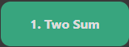

README File Created @ `Created with: stackedit.io/app`

# LeetCode-Typescript-Debugger (LC-TD)
An Angular app which contains LeetCode problems from Problems list.

## Naming
Components should follow `lc#-title-of-problem.component`

## Theme

Denote difficulty with any of these classes

`.easy` &nbsp;&nbsp;&nbsp;&nbsp;&nbsp;&nbsp;&nbsp;&nbsp;&nbsp;&nbsp;&nbsp;

`.medium` &nbsp;&nbsp;&nbsp;&nbsp;&nbsp;&nbsp;&nbsp;&nbsp;&nbsp;&nbsp;&nbsp;

`.hard` &nbsp;&nbsp;&nbsp;&nbsp;&nbsp;&nbsp;&nbsp;&nbsp;&nbsp;&nbsp;&nbsp;

### Usage

      <button
          class="easy"
          tuiButton
          type="button"
          (click)="examples()"
          >
          1. Two Sum
      </button>

## TODO:

2. [ ] Add Link to LeetCode next to button
2. [ ] Add field that takes string and outputs LC-TD component name
2. [ ] Research how to open dev tools on page load
2. [ ] Research is it possible to iterate a directory and render from said directory
   3. [ ] Add list of buttons from `leet-code-problems` folder
